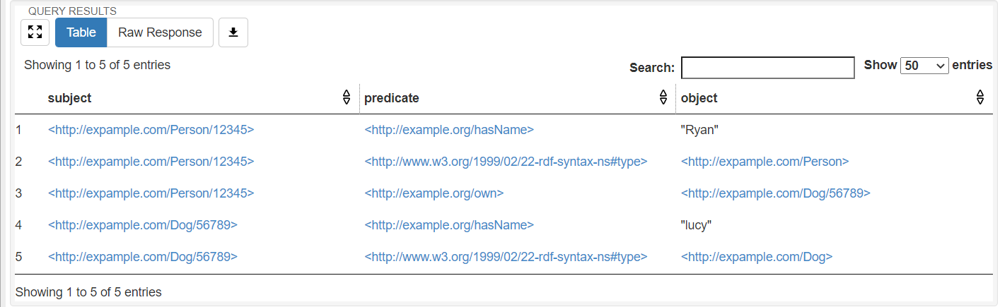

## 定义 RDF Prefix

如前所述，我们将一个 URI 视为“前缀 + 后缀”，由于同一个类的实例我们将它们的前缀表达为相同的值，因此我们可以按照本体设计中的各个类，
在 python 中定义出相应的变量，借助这些变量可以方便地实例化出一个个体（只需要添加上后缀即可）。

我们来看一下最开始的示例中，我们是怎样定义这些 prefix 的：

```python
from pyfuseki.rdf import rdf_prefix, NameSpace as ns

@rdf_prefix('http://expample.com/')
class RdfPrefix():
    Person: ns
    Dog: ns

rp = RdfPrefix()
```

我们将所有表示前缀的变量都放到了一个类中，这个类的每个字段表示了一个前缀，比如 `Person` 表示了 `http://expample.com/Person/` 这样一个前缀。
为了实例化数据，我们所需要做的只有 `rp.Person['Ryan']`，这样我们就得到了一个 URI：`http://expample.com/Person/Ryan`。

查看这个代码，我们可以看到这些字段的类型都是 `ns`，它是 `NameSpace` 的缩写，表示一个命名空间，这是 rdflib 库里的概念，由 NameSpace 便可以生成一个具体的 URI 了。
可以容易猜到，`Person` 这个命名空间的值其实是装饰器 `rdf_prefix` 根据传给他的前缀值 `http://expample.com/` 加上相应成员字段的变量名而生成的。
知道了这个原理，我们就很容易知道这段代码为什么要这样写了。

在一些极少情况下，我们可能需要 `http://expample.com/1A/` 这样的命名空间，但不幸的是，1A 并不能作为 python 的变量名，这时候我们可以这样做：

```python hl_lines="8"
from pyfuseki.rdf import rdf_prefix, NameSpace as ns
from pyfuseki.rdf import NameSpace

@rdf_prefix('http://expample.com/')
class RdfPrefix():
    Person: ns
    Dog: ns
    oneA = NameSpace('http://expample.com/1A/')

rp = RdfPrefix()
```

## 定义 Property

关系也称为属性，按照 OWL 标准，我们将属性分为数据属性和对象属性。由于属性是唯一的，而且不需要实例化，所以定义方式与上一部分的前缀略有不同：

```python
from pyfuseki.rdf import rdf_property
from rdflib import URIRef as uri

@rdf_property('http://example.org/')
class ObjectProperty:
    own: uri 

@rdf_property('http://example.org/')
class DataProperty:
    hasName: uri
```

按照 RDF 规范，每一个属性都一定是一个 URI，我们使用 python 类 `URIRef` 来表示 URI，比如前面我们通过实例化前缀得到的就是一个类型为 URIRef 的变量。
这里，每一个属性的类型也一定是一个 URIRef，为了方便，我们将其简写为 `uri`。

在示例中，我们定义了两个属性： own 和 hasName，装饰器 `rdf_property` 所做的工作与前面的 `rdf_prefix` 类似，也是将传入的参数和成员字段的变量名进行拼接，将拼接得到的字符串转化成一个 URIRef 的值。
比如 own 字段的值就是 `http://example.org/own`。

!!! Tip
    注意 RDFPrefix 类中的成员字段的类型不是 URIRef，而是 NameSpace。
    在 ObjectProperty 和 DataProperty 类中的成员字段类型才是 URIRef。

## 实例化个体

有了 RDF Prefix，我们便可以很轻松地实例化出相应的个体。比如我们一个人 Ryan 便可以 `rp.Person['Ryan']` 这样来得到其 URI（这里的 rp 是 RdfPrefix 的简写）。

实际上，我们刚刚做的事情有一点不规范，因为 URI 是全球唯一的，但可能有多个人叫做 Ryan，这样便无法区分这些人了，因此往往我们是将能够唯一标识一个人的身份证号来作为后缀来实例化这个 URI。
人是有唯一的身份证号的，但对于其他事物，比如一个杯子，很难找到一个能够唯一标识它的特征，因此我们可以使用 UUID 来生成一个全球唯一的标识符，这样工作已经被我们封装了起来，
比如我们想要对 dog 来生成一个全球唯一标识符，只需要 `rp.Dog.uid()` 就可以，这样便可以得到一个唯一标识这只狗的 URIRef。

我们来看一下示例中是怎样来实例化数据的：

```python
person = rp.Person['12345']  # 假设 '12345' 是这个人的唯一身份证号
dog = rp.Dog['56789']  # 假设这只狗也有唯一的 ID 为 ‘56789’
```

## 向 Graph 中插入数据

多条陈述（三元组）构成了一张 **RDF 图** ，在 rdflib 库中使用 `Graph` 这个类来表示，我们也直接使用了这个概念，因此首先需要初始化一张 RDF 图：

```python
from rdflib import Graph

g = Graph()
```

现在我们就可以通过 `add()` 方法向图里面插入 RDF 数据了。但在这之前，还有一些事情要说明。

之前我们虽然通过前缀实例化出了个体，但这些个体只是一个 URI，并不能指示其类型，不是说我通过 rp.Person 实例化了一个个体就可以说这个个体一定是一个“人”类型。
    
因为按照 RDF 标准，一个个体可以属于多个类，甚至可以不属于任何类。由于 OWL 的推理往往需要借助这些个体的类型，因此我们需要为他们声明类型。 
通过添加一条 `<person:Ryan rdf:type :person>` 这样的陈述来完成。其中，主语便是我们实例化得到的 `person` 这个变量，但是怎样表示这个“人”类型呢？
注意，在 RdfPrefix 中的每个成员字段是一个 NameSpace，但我们需要的是一个 URIRef，因此，这种转换可以通过 `rp.Person.to_uri()` 来完成，比如刚刚这种转换就得到了 `http://example.org/Person` 这个 URI。
`rdf:type` 这个关系怎样来表达呢？由于这是一个特殊属性，在 rdflib 库中已经有了定义，我们只需要 `from rdflib import RDF` 后，然后 `RDF.type` 便表示这样一个关系了。

所以我们刚刚想要表达的 `<person:Ryan rdf:type :person>` 这条陈述可以用如下代码来实现：

```python hl_lines="5"
from rdflib import RDF

person = rp.Person['12345']  # 假设 '12345' 是这个人的唯一身份证号

stmt = (person, RDF.type, rp.Person.to_uri())
```

文字型的宾语在 rdflib 中用类型 `Liertal` 表示，我们也沿用了这一概念，因此想要表达刚刚这个人有一个名字“Ryan”，我们可以用代码这样写：

```python
stmt2 = (person, dp.hasName, Literal('Ryan'))
```

有了这些基础，我们就可以看懂最开始的示例中所插入的陈述都是什么意思了：

```python
g.add((person, RDF.type, rp.Person.to_uri()))  # 声明 person 的类型是 Person
g.add((dog, RDF.type, rp.Dog.to_uri()))
g.add((person, dp.hasName, Literal('Ryan')))  # 加入了一条三元组，表示 person1 有名字为 'Ryan'
g.add((dog, dp.hasName, Literal('lucy')))
g.add((person, op.own, dog))  # 声明 Ryan 这个人拥有 lucy 这条狗
```

## 向 Fuseki 插入数据

刚刚我们只是把 RDF 数据插入了 Graph 中，这只是在内存里，我们需要的是将其插入 Fuseki 中，这样便可以将这些数据持久化：

```python
fuseki = FusekiUpdate('http://localhost:3030', 'test_db')
fuseki.insert_graph(g)
```
+ `FusekiUpdate` 的两个参数分别表示 Fuseki 的地址和所要存入的数据库名称。

完成这些工作后，运行代码我们可以看到成功向 Fuseki 中插入了数据：

